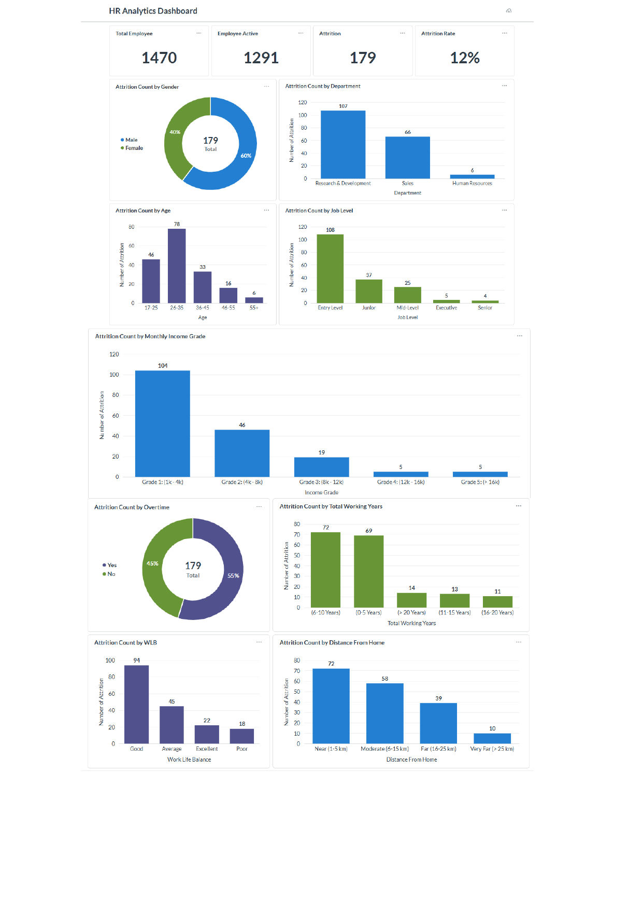

## Proyek Akhir: Menyelesaikan Permasalahan Departemen Human Resources (HR)

### Business Understanding
Jaya Jaya Maju adalah perusahaan multinasional yang telah beroperasi sejak tahun 2000 dengan tenaga kerja mencapai lebih dari 1000 karyawan di seluruh penjuru negeri. Saat ini Jaya Jaya Maju menghadapi tantangan serius berupa tingginya attrition rate (rasio jumlah karyawan yang keluar dengan total karyawan keseluruhan) hingga lebih dari 10%. Angka ini mencerminkan adanya permasalahan dalam manajemen retensi yang berpotensi menyebabkan kerugian finansial akibat biaya rekrutmen ulang serta penurunan produktivitas organisasi.

Untuk mengatasi hal tersebut manajer departemen HR meminta bantuan untuk mengidentifikasi berbagai faktor yang mempengaruhi tingginya attrition rate. Selain itu, ia juga meminta untuk membuat business dashboard untuk membantu memonitori berbagai faktor tersebut.

### Permasalahan Bisnis
Permasalahan bisnis yang sedang dihadapi Jaya Jaya Maju adalah : 
1. Belum teridentifikasinya faktor-faktor determinan yang menjadi pemicu utama tingginya attrition rate.
2. Ketiadaan business dashboard yang dapat digunakan HR untuk memonitor kondisi karyawan.

### Cakupan Proyek
Cakupan proyek yang akan dikerjakan meliputi :
1. Business Understanding: Mengidentifikasi pola dan faktor penyebab tingginya attrition rate serta merumuskan strategi penanganan dampaknya terhadap perusahaan.
2. Data Understanding: Melakukan eksplorasi data awal (EDA) untuk memeriksa kualitas data, mendeteksi nilai yang hilang (missing values), duplikasi data, serta melihat korelasi antar variabel karyawan.
3. Data Preparation: Melakukan pembersihan data, encoding variabel kategori, pemilihan fitur selection menggunakan Embedded Methods, penyeimbangan data menggunakan teknik SMOTE, dan standarisasi fitur agar siap diproses oleh model.
4. Modelling: Membangun model prediksi klasifikasi menggunakan algoritma Random Forest untuk mempelajari karakteristik karyawan yang cenderung mengundurkan diri.
5. Evaluation: Menguji performa model menggunakan metrik Accuracy, Precision, Recall, dan F1-Score untuk memastikan keandalan prediksi sebelum diterapkan.
6. Deployment: Mengembangkan antarmuka prediksi berbasis Streamlit dan Business Dashboard sebagai alat bantu manajemen HR dalam memantau risiko attrition.

### Persiapan
#### Sumber data : [Dataset](https://raw.githubusercontent.com/dicodingacademy/dicoding_dataset/refs/heads/main/employee/employee_data.csv)

#### Setup environment - Anaconda : 
conda create --name attrition-rate python=3.13
conda activate attrition-rate
pip freeze > requirements.txt
pip install -r requirements.txt

### Business Dashboard
Link HR Analytics Dashboard : 
[Dashboard_Metabase](http://localhost:3001/public/dashboard/32dd819b-91f3-41b7-bf04-fcac689d988f)

#### HR Analytics Dashboard Built with Metabase

HR Analytics Dashboard ini dirancang dalam bentuk visualisasi chart/grafik untuk membantu Departemen HR dalam mengidentifikasi faktor-faktor yang mempengaruhi atau memicu terjadinya attrition. 

Adapun bentuk visualisasi yang telah dibuat pada dashboard ini meliputi :

1. Total Employee: Menampilkan jumlah keseluruhan karyawan dalam perusahaan.
2. Employee Active: Menampilkan jumlah karyawan yang saat ini masih aktif bekerja.
3. Attrition : Menampilkan jumlah total karyawan yang telah meninggalkan perusahaan.
4. Attrition Rate: Menampilkan persentasi jumlah total karyawan yang telah meninggalkan perusahaan.
5. Attrition Count by Gender: Visualisasi Pie Chart untuk mengidentifikasi attrition berdasarkan jenis kelamin.
6. Attrition Count by Department: Visualisasi Bar Chart untuk menampilkan jumlah attrition pada setiap department.
7. Attrition Count by Age: Visualisasi Bar Chart untuk melihat distribusi attrition berdasarkan kelompok usia karyawan.
8. Attrition Count by Job Level: Visualisasi Bar Chart untuk mengidentifikasi apakah job level berpengaruh terhadap attrition.
9. Attrition Count by Monthly Income Grade: Visualisasi Bar Chart untuk mengidentifikasi apakah tingkat pendapatan berpengaruh terhadap attrition.
10. Attrition Count by Overtime : Visualisasi Pie Chart untuk menganalisis pengaruh kebijakan lembur terhadap attrition.
11. Attrition Count by Total Working Years : Visualisasi Bar Chart untuk melihat korelasi antara lamanya masa kerja dengan attrition.
12. Attrition Count by WLB: Visualisasi Bar Chart untuk mengukur sejauh mana keseimbangan kehidupan kerja memengaruhi attrition.
13. Attrition by Distance From Home: Visualisasi Bar Chart untuk mengidentifikasi pengaruh jarak tempuh dari rumah ke kantor terhadap attrition.

Diharapkan dengan adanya visualisasi data ini, perusahaan dapat mengambil langkah strategis untuk dapat mengurangi attrition atau meningkatkan retensi karyawan.

#### HR Analytics: Predictive Attrition Dashboard Built with Streamlit

Link Predictive Attrition Dashboard : [Dashboard_Streamlit](https://prediction-hr.streamlit.app)

Dashboard ini dirancang untuk mengotomatisasi prediksi attrition berbasis machine learning guna menghasilkan wawasan preventif yang lebih akurat daripada sekadar visualisasi data statis yang telah dibuat sebelumnya.

### Conclusion
Proyek ini dirancang untuk membantu department HR dalam mengidentifikasi faktor-faktor yang memicu terjadinya attrition.
Melalui integrasi business dashboard dan analisis prediktif, ditemukan bahwa :
* Terdapat 179 karyawan atau 12% dari total karyawan telah meninggalkan perusahaan. 
* Gender : Karyawan laki-laki lebih mendominasi angka attrition dengan persentase 60% (108 karyawan) dibandingkan wanita yang sebesar 40%.
* Departemen : Departemen Research & Development mencatatkan angka attrition tertinggi, yaitu sebanyak 107 karyawan telah meninggalkan perusahaan.
* Age : Karyawan berumur 26-35 tahun paling mendominasi angka attrition yaitu sebanyak 78 karyawan telah meninggalkan perusahaan.
* Job Level : Attrition paling tinggi ditemukan pada tingkat Entry Level, dimana tercatat sebanyak 108 karyawan telah meninggalkan perusahaan.
* Monthly Income Grade : Berdasarkan skala pendapatan bulanan, angka attrition tertinggi berasal dari kelompok grade 1 /berpenghasilan rendah (low income), dengan total 104 karyawan telah meninggalkan perusahaan.
* Overtime : Attirion paling tinggi ditemukan pada karyawan yang sering melakukan lembur yaitu sebanyak 98 karyawan telah meninggalkan perusahaan.
* Total Working Years : Karyawan yang sudah bekerja 6-10 tahun lamanya paling mendominasi attrition yaitu sebanyak 72 karyawan telah meninggalkan perusahaan
* Work Life Balance (WLB) : Tingkat attrition yang dipicu oleh faktor Work-Life Balance tergolong rendah, yaitu hanya mencakup 18 karyawan telah meninggalkan perusahaan.
* Distance From Home : Faktor jarak rumah ke kantor memiliki pengaruh yang paling minimal terhadap attrition, dimana hanya tercatat 10 karyawan yang mengundurkan diri dengan alasan jarak tempuh yang jauh.

### Rekomendasi Action Items
Berikut ini adalah rekomendasi yang dapat diterapkan untuk menekan tingkat attrition :
1. Optimalisasi Gaji dan Benefit
Melakukan peninjauan kembali terhadap struktur gaji dan paket tunjangan agar tetap kompetitif di pasar industri guna meningkatkan kepuasan serta loyalitas karyawan.
2. Penguatan Program Career Path
Menyelenggarakan program pelatihan berkelanjutan dan pemetaan jalur karier yang jelas untuk memberikan prospek pertumbuhan jangka panjang bagi karyawan.
3. Evaluasi dan Restrukturisasi Kebijakan Lembur (Overtime)
Menerapkan sistem pembagian tugas yang lebih merata untuk meminimalisir ketergantungan pada jam kerja tambahan.